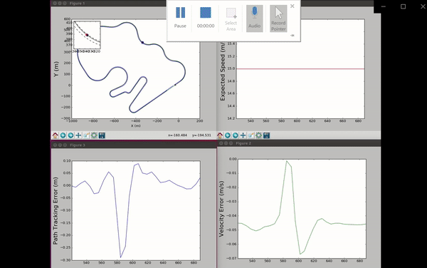

# genesis_path_follower
Code to track a GPS-specified set of waypoints using MPC.  In this branch, the nonlinear kinematic module is used.

**ROHIT GOVINDAN'S DATA VISUALIZATION CHANGES**  
---
I have added code to extract performance parameters from the controller simulation rosbag and plotted them in real time in a series of matplotlib plots.  
 
My Code Changes do the following:  
 
1.)Writing a “Display State” message file to store relevant parameters(current velocity, path tracking error, heading error, etc.). Implementing subscriber and publisher nodes in the “lanekeeping” and “gpsvehicleplotter” files.  
 
2.) Creating an overall vehicle path plot with a visually appealing "Zoom" feature(top left plot in the demo)  
 
3.)Creating other plot objects to display velocity error vs displacement, path tracking error vs displacement and the expected velocity vs displacement. Modifying code to convert plots to “Scrolling” plots.  
 
Here is a DEMO of the plots - they are updated in real time as the vehicle moves along it's path.  
 
The full plot video and my research presentation on the same can be found on my website(Project 02) - https://rohitgovindan.wixsite.com/gettoknowme/projects-1 
  

**DETAILED OVERVIEW OF REPOSITORY**
---
There are three major launch files to use:
  * path_record.launch
    * This is used to record the vehicle state in a demonstrated trajectory.
    * The launch file asks for a matfile of waypoints: this is just to aid in the visualization and isn't used for control.
  * sim_path_follow.launch
    * This uses a dynamic bicycle vehicle model to simulate following the demonstrated trajectory (matfile of waypoints).
    * Initial vehicle pose is required.
  * path_follow.launch
    * This is used to publish commands to the actual vehicle.
  * Common settings:
    * Track path using time (i.e. varying velocity) or with a fixed speed.
    * Reference system is defined based on (lat0, lon0) as the global origin.
    * Use heading (cw from North) or psi (ccw from East).  For the Genesis, we can use the latter one.
---
The launch files use the following scripts:
  * mpc_cmd_pub.jl
    * Subscribes to the state from the vehicle (or vehicle simulator).
    * Queries a reference generator (ref_gps_traj.py) to get the desired open-loop trajectory.  A full global trajectory is provided ahead of time in mat format from the launch file.
    * Uses a nonlinear kinematic MPC model with IPOPT to generate the optimal acceleration and steering angle (tire) commands
    * Publishes the commands to the vehicle's low level controller, along with the desired open-loop trajectory (target_path)
      and the predicted open-loop trajectory MPC solution (mpc_path).

  * vehicle_simulator.py
    * This is for sake of tuning algorithms.  It uses a dynamic bicycle model for high model fidelity.
    * Low-level P controller used to simulate the fact that acceleration/steering angle control inputs are tracked with some delay.  This P gains can be tuned to simulate timing delays on the real vehicle.
    * The topics used for control match the Genesis Interface exactly.  Thus this module can be swapped with the real vehicle interface with no issues.

  * plot_gps_traj.py
    * This is a simple visualizer of the path following behavior.
    * The global trajectory is plotted in black and kept fixed.
    * The vehicle's current state (blue), target path (open-loop reference, in red), and predicted MPC path (green) are updated via subscriber callbacks.

  * state_publisher.py
    * Used for the real vehicle, in place of vehicle_simulator.py.
    * Subscribes to GPS/IMU topics and provides a synchronized version of the vehicle state for convenience.
---
Mat Format for Reference Path (used by ref_gps_traj.py):
  * Keys: 't', 'x', 'y', 'v', 'psi', 'a', 'df', 'lat', 'lon' (i.e. the state information and ROS time)
  * Values: each key is associated with a N-long array, where N is the number of state samples recorded
  * There is also a 'mode' entry (Real, Sim, or Follow) to aid with plotting/analysis and keeping track of data.
---
Contact Vijay Govindarajan (govvijay@berkeley.edu) with any questions or comments.
